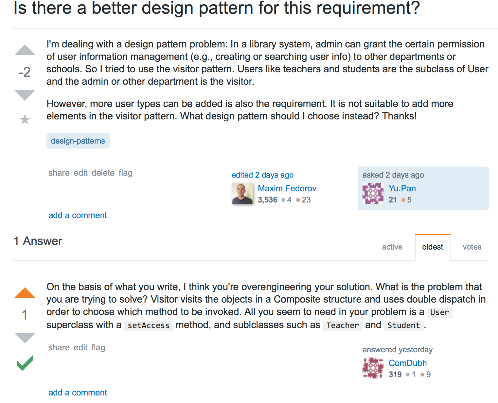

<center>  
    <h1> Nanjing University</h1>

<center> 
    <h1>Software Systems Design & Architecture 
</center>

<center><h1>Assignment 3: Library Info APP</h1>

<center> <h1>In Software Engineering Institute

<center> <h2>by 161250096 Yu Pan<br>
                &nbsp;&nbsp;&nbsp;&nbsp;161250029 Yu Ge
</center>

<center> <h3>Mail: panyuyuyu@outlook.com

<center> <h3> Copyright © 2019 NJU.py. All rights reserved.

# Introduction

Design patterns provide us with a general reusable solution to a common design problem.  They are reusable  since they are tested again and again in design problems. My partner and me use desgin patterns to deal with the atcual requirment problems. Our thoughts and part of the implementations are listed as follows. 

The system is a model app in swift3.x, including a basic UI. A typical **MVC model**. I strongly recommend that you use **Xcode** to execute the whole project for it is only a small model without many tests.  Besides,  it is a great  demo for green hands in ios to learn desgin patterns. We hope the assignment can provide guidance for others in need. All the **class digram** can be seen in the folder **[class diagram](class diagram)**.

GitHub site: https://github.com/Pypy233/Library-Info-App


# Design patterns applied 

## Component1

We use **strategy pattern** to meet the requirments in this part. The requirment itself is not complex: Develop different borrowing methods for different user objects and **new methods or adjustments** can be accommodated. In such case, more attention are focused on the borrowing methods, and the 

* Why we use **strategy pattern** ?

**strategy pattern**  is an object behavioral pattern, mainly for a set of algorithms, each of which is encapsulated into a separate class with a common interface, so that they can be replaced with each other. **strategy pattern** allows the algorithm to change without affecting the client. In general, **strategy pattern** is useful when an application needs to implement a particular service or function, and the program has multiple implementations. According to the requirement, borrowing method is a part of a class that changes frequently or may change in the future. It is suitable to encapsulate borrowing method into a separate class with a common interface for future extension.

* How we use **strategy pattern**?

According to the requirement, borrowing method is a part of a class that changes frequently or may change in the future. For this reason, we extract the borrowing method as an interface and then include an instance of this object in the class, so that the instance of the class can call the behavior of the class that implements the interface at runtime.

There are three objects in the strategy pattern:

(1) Environment object: A reference to an interface or abstract class defined in an abstract policy is implemented in this class. In our system, Environment object is BorrowService Class.

(2) Abstract strategy object: It can be implemented by an interface or an abstract class. In our system,Abstract strategy object is BorrowMethod.

(3) Specific strategy object: It encapsulates different algorithms that implement the same function. In our system,there are three specific strategy objects. They are CommonBorrowMethod , StudentBorrowMethod and TeacherBorrowMethod.

* Advantanges of using **strategy pattern**?

Because of using **strategy pattern**, we can dynamically change the behavior of an object. We don't need to worry about  addition and adjustment of borrowing method. we follow the principle of opening to the extension and closing the revision to make our app more extensible. For adding a new borrowing method, we only need to create a new class which implements BorrowMethod interface and don't need to modify client code.For adjusting a borrowing method,we only need to modify corresponding concrete BorrowingMethod class  and also don't need to modify client code.

## Component2

**Visitor pattern** is applied in this part firstly. Because of the requirement 'more user types will be added', we use **factory** **method** **pattern** to solve it. It is a hard process: code structure itself is a bit complex, not to mention the thinking process. 

At first, we applied the **visitor pattern** to the requirment. Obviously, the visitor pattern is a good choice for permission control. However, there is a need that **"more user types can be added"**. It means that when a new user type is added, we should add a new visitor and implement it's behavior. For future development,  we have to modify UserVisitor interface because of new user types,but as we all know, **Adding bottom element** in the visitor pattern is a **disaster.** We discuessed it for 2 days. 

We find the **ACL pattern** is used to deal with the permission control problem. But it is not practical because it focuses more on the design of database and the entity is more complex than we are dealing with. So we abandoned it.

 Finally, I have no better choice and I posted the problem on the stackOverFlow. I got the answer, the screenshot is as follows:





ComDubh suggested that I were overengineering and should only overwrite the ``setAccess`` method. But after a dicussion with my paterner,to make UserVisitor interface more stable, we finally determined **visitor pattern plus factory method pattern**. For the visitor itself is a simple factory so that the code will not be so terrible. To some extent, we think it is not a  bad choice.

In the [UserVisitor.swift](Library-Info-App/Library-Info-App/UserVisitor.swift), the class is:

```
class UserVisitor {
    
    func visit(user: User) {}
    
}
```

In the [Admin.swift](Library-Info-App/Library-Info-App/Admin.swift)

```swift
override func visit(user: User) {
        switch user.getType() {
            case .Teacher:
                visit(teacher: user as! Teacher)
            case .Graduate:
                visit(graduate: user as! Graduate)
            case .Undergraduate:
                visit(undergraduate: user as! Undergraduate)
        }
    }

```

It proves to be pratical to add user type and control the permission. That is why we choose the combined design patterns.

## Component3

We use **strategy pattern** again in this part, but some differences between component.We also think of  **factory** **method** **pattern** but it is not better than **strategy pattern**. Next, We will explain to you these things.

- Why we use **strategy pattern** ?

**Strategy pattern**  is an object behavioral pattern, mainly for a set of algorithms, each of which is encapsulated into a separate class with a common interface, so that they can be replaced with each other. **strategy pattern** allows the algorithm to change without affecting the client. In general, **strategy pattern** is useful when an application needs to implement a particular service or function, and the program has multiple implementations. According to the requirement, document formats reading is a part of a class that changes frequently or may change in the future. It is suitable to encapsulate document formats reading into a separate class with a common interface for future extension.

- How we use **strategy pattern**?

According to the requirement,document formats reading is a part of a class that changes frequently or may change in the future. Because of  this reason, we extract the document formats reading as an interface and then include an instance of this object in the class, so that the instance of the class can call the behavior of the class that implements the interface at runtime.

There are three objects in the strategy pattern:

(1) Environment object: A reference to an interface or abstract class defined in an abstract policy is implemented in this class. In our system, Environment object is ReaderContext Class.

(2) Abstract strategy object: It can be implemented by an interface or an abstract class. In our system,Abstract strategy object is Reader.

(3) Specific strategy object: It encapsulates different algorithms that implement the same function. In our system,there are three specific strategy objects. They are DocReader , PDFReader and EPUBReader.

- Advantanges of using **strategy pattern**?

Because of using **strategy pattern**, we can dynamically change the behavior of an object. We don't need to worry about  addition and modification of document formats reading. we follow the principle of opening to the extension and closing the revision to make our app more extensible. For adding a document formats reading, we only need to create a new class which implements Reader interface and don't need to modify client code.For modifying a document formats reading,we only need to modify corresponding concrete document formats reading class  and also don't need to modify client code.

Besides, we also think **factory** **method** **pattern** is suitable to Component3. Compared to **strategy pattern**, we do insist that **strategy pattern** is more suitable so we select **strategy pattern** and abandon **factory** **method** **pattern**. Next, we will explain to you the benefits of **factory** **method** **pattern** and reasons why it is not as good as **strategy pattern**.

* Benefits of **factory** **method** **pattern**.


By **factory** **method** **pattern**, our system can return instances of different Reader classes depending on the parameters. **Factory** **method** **pattern** specifically defines a ReaderFactory class to be responsible for creating instances of Reader classes, and the created instances have a common parent class(In our system , it's Reader class).The factory class contains the necessary judgment logic to determine when to create an instance of the Reader class. In that case,the client can dispense with the responsibility of directly creating the Reader object and only "consume" the Reader class.**Factory** **method** **pattern** implements the separation of responsibilities through this approach, which provides specialized factory classes for creating specific Reader objects.The client does not need to know the class name of the specific Reader class created, and only needs to know the parameters corresponding to the specific Reader class.  In all,  Separating the creation of a Reader from the business processing of the Reader itself make our system reduce the degree of coupling of the system, making it relatively easy to modify both. 


* Why we abandon **factory** **method** **pattern** and select **strategy pattern**?

**strategy pattern** focuses on behavior and the encapsulation of the algorithm but **factory** **method** **pattern** focuses on creating the objects that are needed.For document formats reading,we do argue it behaviour not creating objects. In addition to it,The factory class(ReaderFactory) can only create Reader  classes that may be used. If a new Reader class is added, the factory class must be modified, which violates the opening and closing principle.When there are many Reader types, the factory logic may be too complicated, which is not conducive to system expansion and maintenance. Because of these reasons, we do select **strategy pattern** not **factory** **method** **pattern**.

**PS**:In our system's specific implementation, we combine **strategy pattern** with **factory** **method** **pattern**, and initialize it in the factory mode in the context class initialization. 

 **Let us explain to you  the advantages of combining the two patterns.**

- In the [DocReader.swift](Library-Info-App/Library-Info-App/DocReader.swift), method like read doc is:

```swift
class DocReader: Reader {
    func read(filename: String) -> String {
        print("Reading doc...")
        return "DOC"
    }
}

```

- And the type transferred is:

  ```swift
  class ReaderContext {
      private var reader: Reader?
      init(docType: DocType) {
          switch docType {
          case .DOC:
              reader = DocReader()
          case .PDF:
              reader = PDFReader()
          case .EPUB:
              reader = EPUBReader()
          }
      }
      
      func readDoc(filename: String) -> String {
          return (reader?.read(filename: filename)) ?? ""
      }
  }
  
  ```

If the Main function is a client, then every time we add an algorithm, we have to modify it once on the client side, adding an else if, causing unnecessary trouble. So, in the current situation, we first know the existing DocReader,PDFReader and EPUBReader three algorithms, but we are not sure which algorithm to use at runtime, and in order to isolate the client and business logic code, we can create the client creation algorithm. The business logic of the class is transferred to the ReaderContext class and a method of creating an algorithm factory is added.


## Component4

Obviously, **observer pattern** matches the requirments very well. According to the requirement 'administrators can receive the	automatic notification	once a user’s	info is updated', we can easily  think of using **observer pattern** to meet this requirement.

- Why we use **observer pattern** ?

**observer pattern** is suitable in these two following scenes. For one thing,other objects need to be notified when the data of an object is updated, but this object does not want to be tightly coupled with those objects that are notified.For the other,when an object's data is updated, the object needs to have other objects update their own data, but the object does not know how many objects need to update the data. According to the requirement, user is subject and administrator is observer obviously. For future development,once we want to add a new observer,we should only create a new class implementing observer interface and make it become a subject's observer which decouples subjects with observers.

- How we use **observer pattern**?

 As we develop our system with language **swift** and use swift's built-in interface , our implementation has something different with **observer pattern** applied in **java**.

Apple has the great experience of using observer pattern because the daily notification is based on this. We implement it by using the notification inteface. In the [NotificationUtil.swift](Library-Info-App/Library-Info-App/NotificationUtil.swift), I construct the util:

``````swift
class NotificationUtil: NSObject {
    func sendInfoUpdatedMessage(msg: String) {
        let userInfo = ["msg": msg]
        let notification = NSNotification.init(name: NSNotification.Name(rawValue: "User"), object: self, userInfo: userInfo)
        // Post the notification
        NotificationCenter.default.post(notification as Notification)
    }
}

``````

In the [UserDAO.swift](Library-Info-App/Library-Info-App/UserDAO.swift), the method ``updateUser`` contains the notification method, and it shows great usage:

```swift
 public func updateUser(user: User) {
        // Update
        NotificationUtil().sendInfoUpdatedMessage(msg: "User info updated")
    }
```

- Advantanges of using **observer pattern**?

Because of using **observer pattern**, different observers triggering responses are encapsulated in separate objects so that they can be changed and reused independently of each other. For adding a new observer , we should only create a new class implementing observer interface and make it become a subject's observer. For modifying a observer's triggering response, what we need to do is to modify coresponding specific observer class.Whether adding a new observer or modifying a observer will not affect code in subject which decouples subjects with observers.


# Contribution

## 161250096 Yu Pan      

I set up the basic arthiecture of the project and write the code about component1, 2. I discussed with my partner about the design pattern. Also, I reviewed his code about the other two components and class diagram.


## 161250029 Yu Ge      

I write the code about component3, 4. I discussed with my partner about the design pattern. Also, I reviewed his code about the other two components and class diagram. For these four components，Component2 takes my partner and me much time but we learn a lot such as Pattern Combination by dealing with it.